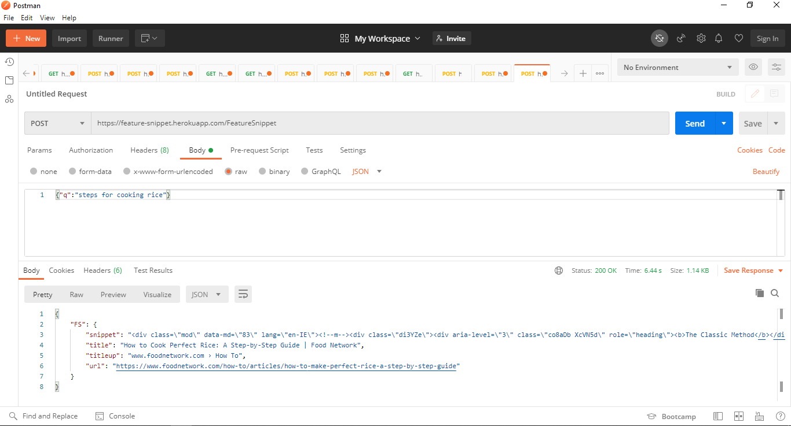

                          _    _    _    _    _    _    _     _    _    _    _    _    _    _
                         / \  / \  / \  / \  / \  / \  / \   / \  / \  / \  / \  / \  / \  / \
                        ( F )( e )( a )( t )( u )( r )( e ) ( S )( n )( i )( p )( p )( e )( t )
                         \_/  \_/  \_/  \_/  \_/  \_/  \_/   \_/  \_/  \_/  \_/  \_/  \_/  \_/
# Introduction
> What is Feature snippet?

Featured snippets are selected search results that are featured on top of Google's organic results below the ads in a box. Featured snippets aim at answering the user's question right away.

> API request



```python
import requests
import json
url = 'https://feature-snippet.herokuapp.com/FeatureSnippet'
headers = {'content-type': 'application/json'}
query=json.dumps({"q":"steps for cooking rice"})
output = requests.post(url, data = query,verify=True,headers=headers)
```
To check status code
            output.status_code
To fetch output data
            output.json()

Sample Output
```text
{'FS': {'snippet': '<div class="mod" data-md="83" lang="en-IN"><!--m--><div '
                   'class="di3YZe"><div aria-level="3" class="co8aDb XcVN5d" '
                   'role="heading"><b>The Classic Method</b></div><div '
                   'class="RqBzHd"><ol class="X5LH0c"><li class="TrT0Xe">Rinse '
                   'the <b>rice</b>.</li><li class="TrT0Xe">Use the right '
                   'ratio of water. Add 2 parts water and 1 part <b>rice</b> '
                   'to a large pot. ... </li><li class="TrT0Xe">Bring the '
                   "water to a boil. Once it's boiling, add a big pinch of "
                   'salt.</li><li class="TrT0Xe">Maintain a simmer. ... '
                   '</li><li class="TrT0Xe"><b>Cook</b> without peeking or '
                   'stirring. ... </li><li class="TrT0Xe">Let the <b>rice</b> '
                   'rest covered. ... </li><li class="TrT0Xe">Fluff the '
                   '<b>rice</b> with a '
                   'fork.</li></ol></div></div><!--n--></div>',
        'title': 'How to Cook Perfect Rice: A Step-by-Step Guide | Food '
                 'Network',
        'titleup': 'www.foodnetwork.com › How To',
        'url': 'https://www.foodnetwork.com/how-to/articles/how-to-make-perfect-rice-a-step-by-step-guide'}}
```

> Usage example
```python
from IPython.core.display import display, HTML
display(HTML(output.json()["FS"]["snippet"]))
display(HTML(output.json()["FS"]["titleup"]))
display(HTML(output.json()["FS"]["title"]))
output.json()["FS"]["url"]
```
> Rendered Output
```
The Classic Method
-  Rinse the rice.
-  Use the right ratio of water. Add 2 parts water and 1 part rice to a large pot. ...
-  Bring the water to a boil. Once it's boiling, add a big pinch of salt.
-  Maintain a simmer. ...
-  Cook without peeking or stirring. ...
-  Let the rice rest covered. ...
-  Fluff the rice with a fork.
www.foodnetwork.com › How To
How to Cook Perfect Rice: A Step-by-Step Guide | Food Network
'https://www.foodnetwork.com/how-to/articles/how-to-make-perfect-rice-a-step-by-step-guide'
```

# Author
Ashish Kumar

# License
[](https://github.com/ashishcssom/Feature-snippet/blob/main/LICENSE)
```
Copyright (c) 2021 Ashish Kumar
```

# Contact
[](https://www.linkedin.com/in/ashishk766/) 
[](mailto:ashish.krb7@gmail.com) 

